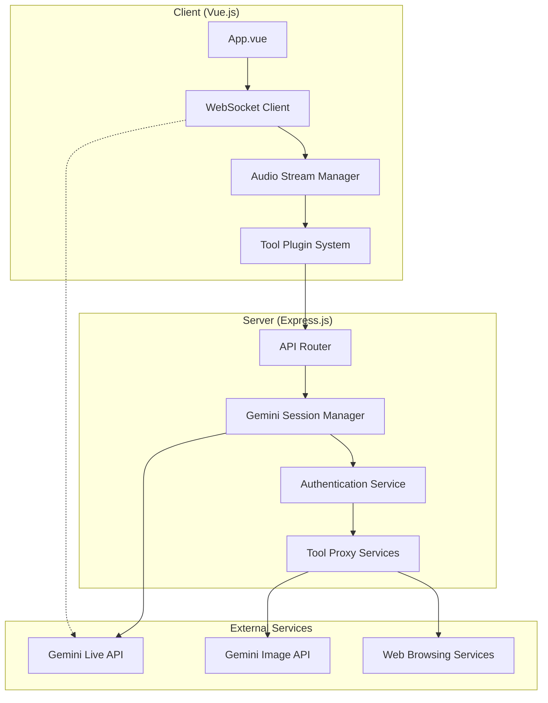
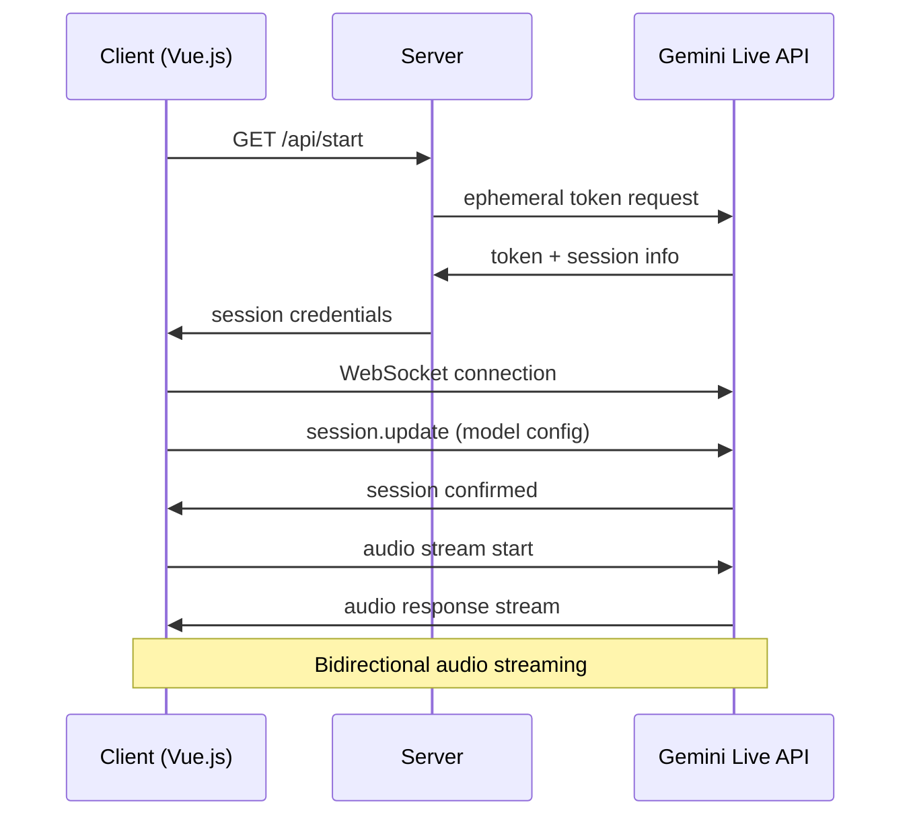
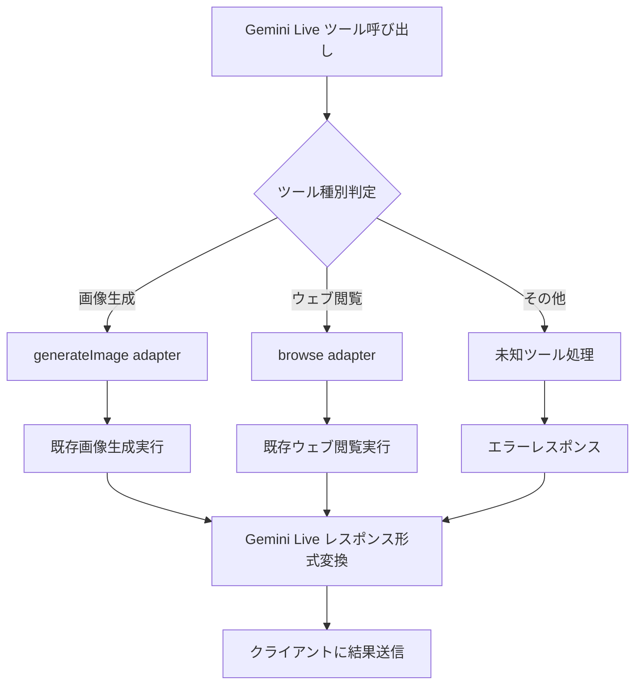
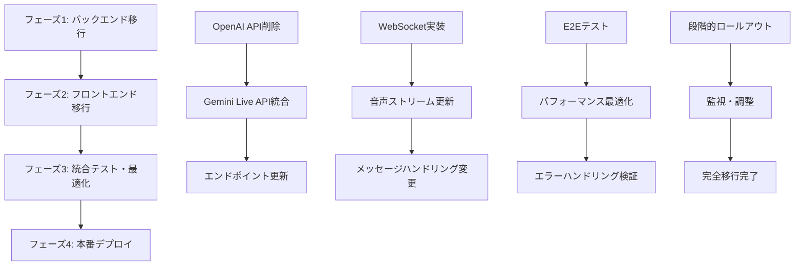

# 技術設計文書

## 概要
この機能は、現在OpenAIリアルタイムAPIに依存している音声会話システムを、GoogleのGemini Live（gemini-2.5-flash-preview-native-audio-dialogモデル）に移行することを目的としています。主な目標はAPI費用の削減と、音声品質の向上を含む既存機能の維持・強化です。

**対象ユーザー**: MulmoChatアプリケーションのエンドユーザーは、移行後も同等以上の音声会話体験を継続して利用できます。

**影響範囲**: 現在のOpenAI中心のアーキテクチャから、Gemini Liveを活用したハイブリッドアーキテクチャへの移行により、WebRTC通信プロトコルとセッション管理方式が変更されます。

### 目標
- OpenAI Realtime APIをGemini Live APIに完全移行してAPI費用を削減
- 既存のツール機能（画像生成、ウェブ閲覧）の継続的な提供
- 音声会話品質の維持または向上（Gemini Liveの30種類以上の音声、24言語対応）
- シームレスな移行によるユーザーエクスペリエンス維持

### 非目標
- 新しいUI機能の追加（現在のインターフェースを維持）
- OpenAI以外の他のサービス（画像生成、ウェブ閲覧）への移行
- 複数AI提供者の同時サポート（将来の拡張として保留）

## アーキテクチャ

### 既存アーキテクチャ分析
現在のシステムは以下の構成となっています：

- **バックエンド**: Express.js + TypeScript、OpenAI client_secrets API認証
- **フロントエンド**: Vue.js 3 + WebRTC（RTCPeerConnection + データチャネル）
- **通信プロトコル**: OpenAI専用WebRTCデータチャネル経由でのセッション管理
- **既存ツール統合**: Gemini API（画像生成）、mulmocast（ウェブ閲覧）、Twitter oEmbed

### 高レベルアーキテクチャ



### アーキテクチャ統合
**既存パターンの保持**:
- Express.js + TypeScript サーバーアーキテクチャを維持
- Vue.js 3 Composition APIパターンを継続
- 既存のツールプラグインシステム（画像生成、ウェブ閲覧）を保持

**新しいコンポーネントの根拠**:
- **Gemini Session Manager**: OpenAI session管理をGemini Live仕様に置換
- **WebSocket Client**: WebRTCデータチャネルからWebSocketベース通信に変更
- **Audio Stream Manager**: Gemini Live音声仕様（16kHz入力、24kHz出力）に対応

**技術的整合性**:
- @google/genai既存依存関係（v1.17.0）を活用
- 既存のCORS、dotenv設定を維持
- TypeScript型安全性を全域で維持

### 技術スタックと設計決定

**技術的整合性**:
現在の技術スタックと完全に整合：
- **バックエンド**: Express.js 5.1.0 + TypeScript 5.4.5（変更なし）
- **フロントエンド**: Vue.js 3.4.21 + Composition API（変更なし）
- **AI統合**: @google/genai 1.17.0（バージョン確認・更新の可能性）
- **ビルドツール**: Vite 5.3.3 + vue-tsc（変更なし）

**新しい依存関係**:
- 追加ライブラリは不要（@google/genaiで対応可能）
- 必要に応じてWebSocket関連のTypeScript型定義を追加

**重要な設計決定**:

**決定1: プロトコル変更 - WebRTCからWebSocketへ**
- **選択**: OpenAI WebRTCデータチャネルからGemini Live WebSocketに移行
- **コンテキスト**: OpenAIとGemini Liveで通信プロトコルが根本的に異なる
- **代替案**:
  1. WebRTC維持でプロキシサーバー実装
  2. 段階的移行（両方対応）
  3. 直接WebSocket移行
- **選択アプローチ**: 直接WebSocket移行
- **根拠**: シンプルな実装、Gemini Live公式サポート、低レイテンシ
- **トレードオフ**: WebRTC固有の利点（帯域幅制御等）を放棄するが、実装複雑度を大幅削減

**決定2: セッション管理方式**
- **選択**: Gemini Live ephemeral tokenベース認証
- **コンテキスト**: OpenAI client_secrets APIとGemini Live認証方式の違い
- **代替案**:
  1. 直接API Key使用（セキュリティリスク）
  2. サーバーサイドプロキシ
  3. Ephemeral token使用
- **選択アプローチ**: Ephemeral token使用
- **根拠**: セキュリティベストプラクティス、クライアント直接接続可能
- **トレードオフ**: セッション管理複雑度増加、トークン有効期限管理必要

**決定3: ツール互換性保持**
- **選択**: 既存ツールシステムをGemini Live関数呼び出しに適応
- **コンテキスト**: OpenAIとGemini Liveで関数呼び出し形式が異なる
- **代替案**:
  1. 全ツール再実装
  2. アダプターパターン実装
  3. Gemini Live形式に直接変換
- **選択アプローチ**: アダプターパターン実装
- **根拠**: 既存コード再利用、段階的移行可能、保守性向上
- **トレードオフ**: 追加の抽象化レイヤー、若干の性能オーバーヘッド

## システムフロー

### 音声会話開始フロー



### ツール呼び出しフロー



## 要件トレーサビリティ

| 要件 | 要件概要 | コンポーネント | インターフェース | フロー |
|------|----------|----------------|------------------|--------|
| 1.1 | バックエンドAPI統合 | GeminiSessionManager, APIRouter | /api/start, ephemeral token API | 音声会話開始フロー |
| 2.1 | フロントエンドWebRTC通信 | WebSocketClient, AudioStreamManager | WebSocket, audio stream APIs | 音声会話開始フロー |
| 3.1 | メッセージハンドリング | MessageHandler, ProtocolAdapter | Gemini Live message protocol | 双方向通信フロー |
| 4.1 | ツール統合互換性 | ToolAdapter, PluginSystem | tool call interfaces | ツール呼び出しフロー |
| 5.1 | 依存関係管理 | PackageManager | @google/genai update | - |
| 6.1 | コスト最適化 | GeminiSessionManager | ephemeral token management | セッション管理 |

## コンポーネントとインターフェース

### バックエンド層

#### GeminiSessionManager

**責任と境界**
- **主要責任**: Gemini Live APIセッション管理とephemeral token生成
- **ドメイン境界**: 認証・セッション管理ドメイン
- **データ所有権**: セッショントークン、認証状態、セッション設定情報
- **トランザクション境界**: セッション作成・無効化の一貫性保証

**依存関係**
- **インバウンド**: APIRouter、認証ミドルウェア
- **アウトバウンド**: Gemini Live API、環境変数管理
- **外部**: @google/genai library

**外部依存関係調査**:
- **@google/genai v1.17.0**: gemini-2.5-flash-preview-native-audio-dialog対応確認済み
- **認証フロー**: OAuth 2.0ベースのephemeral token生成
- **レート制限**: セッション作成頻度制限（詳細は実装時に調査）
- **API仕様**: WebSocket接続エンドポイント、メッセージフォーマット

**サービスインターフェース**:
```typescript
interface GeminiSessionManagerService {
  createSession(config: SessionConfig): Promise<Result<SessionResponse, SessionError>>;
  refreshToken(sessionId: string): Promise<Result<string, AuthError>>;
  validateSession(sessionId: string): Promise<Result<boolean, ValidationError>>;
  closeSession(sessionId: string): Promise<Result<void, CloseError>>;
}

interface SessionConfig {
  systemInstructions: string;
  model: "gemini-2.5-flash-preview-native-audio-dialog";
  audioConfig: AudioConfiguration;
  tools: ToolDeclaration[];
}

interface SessionResponse {
  sessionId: string;
  ephemeralToken: string;
  websocketUrl: string;
  expiresAt: Date;
}
```

**事前条件**: GEMINI_API_KEYが設定済み、有効なAPIキー
**事後条件**: 有効なephemeral tokenとWebSocket URL提供
**不変条件**: セッションIDの一意性、トークン有効期限管理

#### APIRouter

**責任と境界**
- **主要責任**: RESTエンドポイント管理と既存ツール機能の維持
- **ドメイン境界**: HTTP API層、リクエスト/レスポンス処理
- **データ所有権**: リクエスト検証、レスポンス形式、エラーハンドリング

**統合戦略**:
- **修正アプローチ**: 既存/api/startエンドポイントをGemini Live用に変更
- **後方互換性**: レスポンス形式を維持（ephemeralKey → ephemeralToken）
- **移行パス**: 段階的な置換、既存エンドポイント（画像生成、ブラウジング）は維持

**APIコントラクト**:
| メソッド | エンドポイント | リクエスト | レスポンス | エラー |
|---------|----------------|------------|-----------|---------|
| GET | /api/start | - | SessionStartResponse | 400, 500 |
| POST | /api/generate-image | ImageRequest | ImageResponse | 400, 500 |
| POST | /api/browse | BrowseRequest | BrowseResponse | 400, 500 |

```typescript
interface SessionStartResponse {
  success: boolean;
  message: string;
  ephemeralToken: string; // 旧ephemeralKeyから変更
  websocketUrl: string; // 新規追加
  googleMapKey?: string;
}
```

### フロントエンド層

#### WebSocketClient

**責任と境界**
- **主要責任**: Gemini Live WebSocket通信管理と音声ストリーミング
- **ドメイン境界**: リアルタイム通信、音声データ処理
- **データ所有権**: WebSocket接続状態、音声ストリーム、メッセージキュー

**依存関係**
- **インバウンド**: App.vue、AudioStreamManager
- **アウトバウンド**: Gemini Live WebSocket API、ブラウザWebSocket API
- **外部**: Web Audio API、MediaDevices API

**統合戦略**:
- **修正アプローチ**: 既存WebRTCコードを置換、新しいWebSocketベース通信に移行
- **後方互換性**: startChat(), stopChat()メソッドシグネチャを維持
- **移行パス**: WebRTC → WebSocket完全置換

**サービスインターフェース**:
```typescript
interface WebSocketClientService {
  connect(sessionConfig: SessionCredentials): Promise<Result<void, ConnectionError>>;
  sendMessage(message: GeminiLiveMessage): Promise<Result<void, SendError>>;
  disconnect(): Promise<Result<void, DisconnectionError>>;
  onMessage(handler: (message: GeminiLiveMessage) => void): void;
  onStatusChange(handler: (status: ConnectionStatus) => void): void;
}

interface SessionCredentials {
  ephemeralToken: string;
  websocketUrl: string;
  sessionId: string;
}

interface GeminiLiveMessage {
  type: "session.update" | "audio.input" | "text.input" | "tool.response";
  payload: Record<string, unknown>;
}
```

**事前条件**: 有効なsession credentials、マイクアクセス許可
**事後条件**: アクティブなWebSocket接続、音声ストリーム開始
**不変条件**: 接続状態の一貫性、音声品質維持

#### AudioStreamManager

**責任と境界**
- **主要責任**: Gemini Live音声仕様に対応したオーディオ処理
- **ドメイン境界**: 音声入出力、デジタル信号処理
- **データ所有権**: 音声バッファ、サンプリングレート変換、音声品質設定

**コントラクト定義**:
```typescript
interface AudioStreamManagerService {
  setupInput(): Promise<Result<MediaStream, AudioError>>;
  setupOutput(): Promise<Result<HTMLAudioElement, AudioError>>;
  startStreaming(): Promise<Result<void, StreamError>>;
  stopStreaming(): Promise<Result<void, StreamError>>;
  configureAudio(config: AudioConfig): Result<void, ConfigError>;
}

interface AudioConfig {
  inputSampleRate: 16000; // Gemini Live requirement
  outputSampleRate: 24000; // Gemini Live output
  channels: 1; // Mono
  bitDepth: 16;
}
```

**状態管理**:
- **状態モデル**: idle → connecting → streaming → disconnecting → idle
- **永続化**: なし（セッション単位）
- **並行性**: 単一音声ストリーム管理

#### ToolAdapter

**責任と境界**
- **主要責任**: OpenAI形式とGemini Live形式のツール呼び出し変換
- **ドメイン境界**: ツール統合、プロトコル変換
- **データ所有権**: ツール定義、呼び出し履歴、変換ルール

**統合戦略**:
- **修正アプローチ**: 既存pluginToolsシステムをラップ、Gemini Live形式に変換
- **後方互換性**: 既存のgenerateImage、browseツールを維持
- **移行パス**: アダプターパターンで段階的変換

**サービスインターフェース**:
```typescript
interface ToolAdapterService {
  convertToGeminiFormat(openaiTool: OpenAITool): GeminiTool;
  executeToolCall(toolCall: GeminiToolCall): Promise<Result<ToolResult, ToolError>>;
  registerTool(tool: ToolDefinition): Result<void, RegistrationError>;
}

interface GeminiTool {
  function_declarations: Array<{
    name: string;
    description: string;
    parameters: JSONSchema;
  }>;
}

interface GeminiToolCall {
  name: string;
  args: Record<string, unknown>;
  call_id: string;
}
```

## データモデル

### 論理データモデル

**セッション管理**:
```typescript
interface Session {
  sessionId: string;
  ephemeralToken: string;
  websocketUrl: string;
  createdAt: Date;
  expiresAt: Date;
  status: "active" | "expired" | "closed";
  audioConfig: AudioConfiguration;
}

interface AudioConfiguration {
  inputSampleRate: 16000;
  outputSampleRate: 24000;
  channels: 1;
  codec: "pcm" | "opus";
}
```

**メッセージプロトコル**:
```typescript
interface GeminiLiveMessage {
  type: MessageType;
  timestamp: number;
  payload: MessagePayload;
}

type MessageType =
  | "session.update"
  | "audio.input"
  | "audio.output"
  | "text.input"
  | "text.output"
  | "tool.call"
  | "tool.response"
  | "error";

interface SessionUpdatePayload {
  session: {
    model: "gemini-2.5-flash-preview-native-audio-dialog";
    system_instruction: string;
    tools: GeminiTool[];
    generation_config: GenerationConfig;
  };
}
```

**ツール定義**:
```typescript
interface ToolDefinition {
  name: string;
  description: string;
  parameters: JSONSchema;
  handler: ToolHandler;
}

interface ToolResult {
  success: boolean;
  data?: unknown;
  message: string;
  imageData?: string;
  htmlData?: string;
  jsonData?: unknown;
}
```

### データコントラクトと統合

**APIデータ転送**:
```typescript
interface StartApiResponse {
  success: boolean;
  message: string;
  ephemeralToken: string;
  websocketUrl: string;
  googleMapKey?: string;
}

interface ToolCallResponse {
  type: "function_call_output";
  call_id: string;
  output: string; // JSON serialized ToolResult
}
```

**スキーマバージョニング戦略**:
- **後方互換性**: 既存レスポンス形式維持（ephemeralKey → ephemeralToken移行）
- **段階的移行**: websocketUrl等の新フィールドをoptionalから順次required化

## エラーハンドリング

### エラー戦略
各エラー種別に対する具体的な処理パターンと復旧メカニズム：

**接続エラー**: 自動再接続（指数バックオフ）、フォールバック接続試行
**認証エラー**: トークン再取得、セッション再構築
**音声品質エラー**: サンプリングレート調整、コーデック切り替え
**ツール実行エラー**: グレースフルデグラデーション、代替実装

### エラーカテゴリとレスポンス

**ユーザーエラー（4xx）**:
- **無効セッション設定** → 設定検証ガイダンス、デフォルト値提案
- **マイクアクセス拒否** → 権限要求ガイダンス、代替入力方法
- **未サポートブラウザ** → 対応ブラウザ案内、機能制限モード

**システムエラー（5xx）**:
- **Gemini Live API障害** → グレースフルデグラデーション、ローカル処理
- **WebSocket接続失敗** → サーキットブレーカー、再接続ロジック
- **音声処理リソース不足** → 品質設定自動調整、負荷制限

**ビジネスロジックエラー（422）**:
- **セッション有効期限切れ** → 自動セッション更新、継続的認証
- **ツール実行制限** → 制限説明、代替手段提案

### 監視
**エラー追跡**: セッション単位のエラーログ、Gemini Live API応答監視
**ログ記録**: 構造化ログ（JSON）、音声品質メトリクス
**ヘルスモニタリング**: WebSocket接続状態、トークン有効期限、ツール応答時間

## テスト戦略

### ユニットテスト
- **GeminiSessionManager**: トークン生成、セッション管理、エラーハンドリング
- **WebSocketClient**: 接続管理、メッセージ送受信、状態遷移
- **AudioStreamManager**: サンプリングレート変換、音声品質制御
- **ToolAdapter**: プロトコル変換、既存ツール互換性

### 統合テスト
- **セッション開始フロー**: /api/start → WebSocket接続 → 音声ストリーム開始
- **ツール呼び出しフロー**: 音声 → ツール検出 → 実行 → レスポンス → 音声応答
- **エラー復旧フロー**: 接続切断 → 自動再接続 → セッション復元
- **音声品質検証**: 延滞測定、音声明瞭度、ノイズ除去効果

### E2Eテスト
- **完全音声会話**: セッション開始 → 対話 → ツール使用 → セッション終了
- **長時間セッション**: トークン更新、メモリ管理、品質維持
- **マルチブラウザ対応**: Chrome、Firefox、Safari、Edge
- **モバイル対応**: iOS Safari、Android Chrome

### パフォーマンステスト
- **同時セッション**: 複数ユーザー同時接続時の性能
- **音声遅延測定**: エンドツーエンドレイテンシ測定
- **リソース使用量**: CPU、メモリ、帯域幅使用量監視
- **スケーラビリティ**: セッション数増加時の性能劣化測定

## 移行戦略

### 移行フェーズ



**プロセス**:
- **フェーズ1（1-2週間）**: バックエンドAPI変更、Gemini Live統合
- **フェーズ2（1-2週間）**: フロントエンドWebSocket実装、UI調整
- **フェーズ3（1週間）**: 統合テスト、バグ修正、性能最適化
- **フェーズ4（1週間）**: 段階的デプロイ、監視、最終調整

**ロールバックトリガー**:
- 音声品質著しい劣化（レイテンシ>500ms、明瞭度<80%）
- セッション成功率<95%
- ツール機能正常動作率<98%
- ユーザー満足度著しい低下

**検証チェックポイント**:
- フェーズ1: API応答時間、トークン生成成功率
- フェーズ2: 音声品質、WebSocket接続安定性
- フェーズ3: 全体フロー動作、エラー率
- フェーズ4: 本番負荷での安定性、ユーザーフィードバック